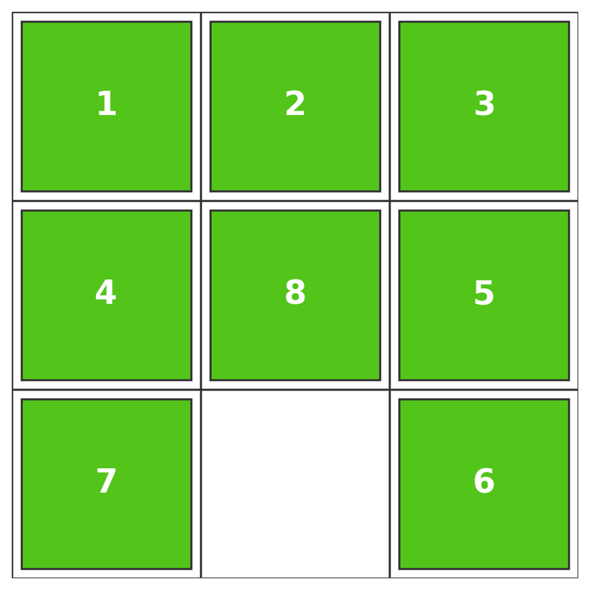
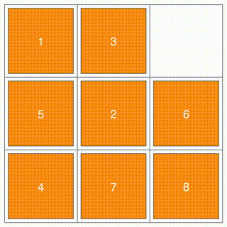
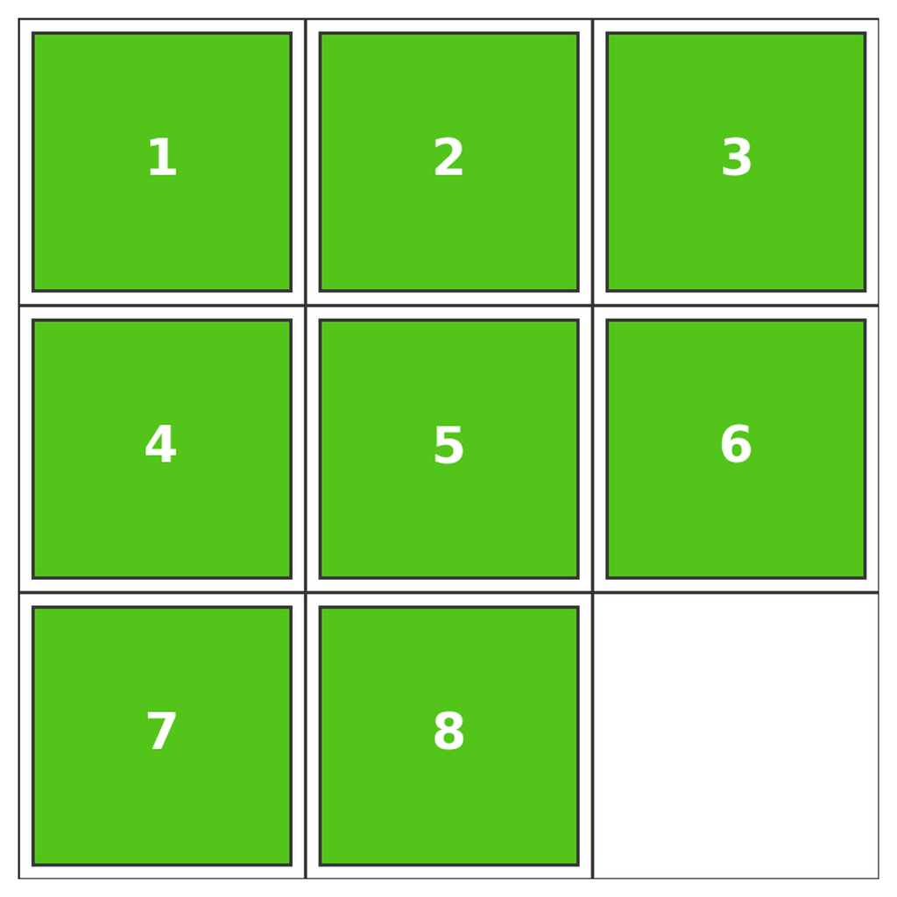

# O-47: Sliding Puzzle Data Generator

Generates synthetic sliding tile puzzle tasks where numbered tiles must be rearranged into sequential order by sliding them into the blank space. Tests spatial reasoning, sequential planning, and multi-step problem solving.

Each sample pairs a **task** (first frame + prompt describing what needs to happen) with its **ground truth solution** (final frame showing the result + video demonstrating how to achieve it). This structure enables both model evaluation and training.

---

## 📌 Basic Information

| Property | Value |
|----------|-------|
| **Task ID** | O-47 |
| **Task** | Sliding Puzzle |
| **Category** | Puzzle Solving/Sequential Planning |
| **Resolution** | 1024×1024 px |
| **FPS** | 16 fps |
| **Duration** | varies |
| **Output** | PNG images + MP4 video |

---

## 🚀 Usage

### Installation

```bash
# Clone the repository
git clone https://github.com/VBVR-DataFactory/O-47_sliding_puzzle_data-generator.git
cd O-47_sliding_puzzle_data-generator

# Install dependencies
pip install -r requirements.txt
```

### Generate Data

```bash
# Generate 100 samples
python examples/generate.py --num-samples 100

# Generate with specific seed
python examples/generate.py --num-samples 100 --seed 42

# Generate without videos
python examples/generate.py --num-samples 100 --no-videos

# Custom output directory
python examples/generate.py --num-samples 100 --output data/my_output
```

### Command-Line Options

| Argument | Type | Description | Default |
|----------|------|-------------|---------|
| `--num-samples` | int | Number of samples to generate | 100 |
| `--seed` | int | Random seed for reproducibility | Random |
| `--output` | str | Output directory | data |
| `--no-videos` | flag | Skip video generation | False |

---

## 📖 Task Example

### Prompt

```
Complete this sliding puzzle. The goal is to arrange the numbered tiles in sequential order (filling each row from left to right, with rows from top to bottom), with the blank space at the bottom-right corner.

Rules: Only tiles adjacent to the blank space can be moved. Slide one tile per move into the blank space.

Complete in exactly 5 moves.

Do not make extra moves. Keep the camera view fixed and maintain the grid structure unchanged.
```

### Visual

<table>
<tr>
  <td align="center"></td>
  <td align="center"></td>
  <td align="center"></td>
</tr>
<tr>
  <td align="center"><b>Initial Frame</b><br/>Tiles in scrambled configuration</td>
  <td align="center"><b>Animation</b><br/>Tiles sliding to solve puzzle</td>
  <td align="center"><b>Final Frame</b><br/>Tiles in sequential order</td>
</tr>
</table>

---

## 📖 Task Description

### Objective

Rearrange numbered tiles from a scrambled configuration into sequential order (1, 2, 3, ...) by sliding tiles into the blank space, with the blank ending at the bottom-right corner.

### Task Setup

- **Puzzle Sizes**: 3×3, 4×4, or 5×5 grids (default mixed distribution: 30% 3×3, 40% 4×4, 30% 5×5)
- **Numbered Tiles**: Sequential numbers filling all positions except one blank space
- **Movement Rule**: Only tiles adjacent to blank space (up, down, left, right) can slide
- **Move Constraints**: Specified number of moves (3-15 depending on puzzle size)
- **Goal State**: Tiles arranged sequentially, blank at bottom-right
- **Generation Methods**: Random valid states or reverse from goal state
- **Color Themes**: 10 color themes (random selection or specified)

### Key Features

- **Multi-step planning**: Requires planning sequence of moves to reach goal state
- **Constraint satisfaction**: Must work within adjacency and move count constraints
- **State space search**: Explores possible configurations to find solution path
- **Optimal or near-optimal solutions**: Generated with specified move counts
- **Variable difficulty**: Puzzle size and move count scale complexity
- **Fixed camera**: Grid structure and view remain unchanged
- **Color variety**: Multiple color themes for tiles enhance visual diversity

---

## 📦 Data Format

```
data/sliding_puzzle_task/
├── sliding_puzzle_0000/
│   ├── first_frame.png          # Initial state (scrambled tiles)
│   ├── final_frame.png          # Final state (solved puzzle)
│   ├── prompt.txt               # Task instructions with move count
│   └── ground_truth.mp4         # Solution video (16 fps)
├── sliding_puzzle_0001/
│   └── ...
```

**File specifications**: Images are 1024×1024 PNG. Videos are MP4 at 16 fps, duration varies by move count.

---

## 🏷️ Tags

`puzzle-solving` `sequential-planning` `spatial-reasoning` `constraint-satisfaction` `state-space-search` `multi-step-reasoning` `sliding-tiles`

---
